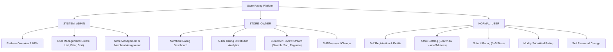
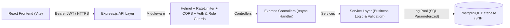

# 🌟 Store Rating Platform - Full-Stack Application

A scalable, production-grade full-stack web application for a **Store Rating Platform**, built with **React.js 18**, **Express.js (3-Tier Service Architecture)**, **PostgreSQL 14+**, and **JWT Authentication with Role-Based Access Control (RBAC)**.

---

## 📑 Table of Contents
- [Executive Overview](#-executive-overview)
- [Technology Stack](#-technology-stack)
- [User Roles & Permissions](#-user-roles--permissions)
- [System Architecture](#-system-architecture)
- [Project Directory Structure](#-project-directory-structure)
- [Quick Start Guide](#-quick-start-guide)
- [Environment Variables](#-environment-variables)
- [PostgreSQL Database Setup & Migrations](#-postgresql-database-setup--migrations)
- [Default Seeded Credentials](#-default-seeded-credentials)
- [REST API Endpoints Reference](#-rest-api-endpoints-reference)
- [Automated Backend Test Suite](#-automated-backend-test-suite)
- [Production Deployment Guide](#-production-deployment-guide)
- [Security & Validation Standards](#-security--validation-standards)

---

## 🚀 Executive Overview

The Store Rating Platform allows normal consumers to browse registered retail stores, search and filter by location and name, submit 1–5 star ratings with feedback comments, and modify their reviews. Store owners gain access to a dedicated merchant analytics dashboard with real-time score averages, 5-tier distribution breakdowns, and paginated customer reviews. System administrators exercise governance over platform users, store registrations, merchant assignments, and platform analytics.

---

## 🛠️ Technology Stack

| Layer | Technology | Details |
| :--- | :--- | :--- |
| **Frontend** | React 18 + Vite | Modern reactive single-page app, custom CSS design system, Lucide icons, Axios client |
| **Backend** | Node.js + Express.js | 3-Tier Layered Architecture (`Routes` $\rightarrow$ `Controllers` $\rightarrow$ `Services` $\rightarrow$ `Database Pool`) |
| **Database** | PostgreSQL 14+ | 3NF Normalized relational schema, composite unique constraints, B-Tree performance indexes |
| **Security** | JWT + Bcrypt + Helmet | Bearer token authorization, 12-round salted password hashing, sliding-window rate limiting |
| **Validation** | Express-Validator | Strict multi-field schema validation, regex checks, and SQL injection prevention |

---

## 👥 User Roles & Permissions



| Role | Key Capabilities & Accessible Workflows |
| :--- | :--- |
| **`SYSTEM_ADMIN`** | • Full user management with live multi-field filtering, click-to-sort, and pagination<br>• Store management, store creation, and store owner merchant assignments<br>• System-wide statistics and analytical dashboard access (`totalUsers`, `totalStores`, `totalRatings`, role distributions) |
| **`STORE_OWNER`** | • Dedicated merchant dashboard with store details, average rating (1 decimal precision), and review counts<br>• 5-star distribution breakdowns (`5★`, `4★`, `3★`, `2★`, `1★`)<br>• Searchable, sortable, and paginated customer rating table with customer names, emails, and ratings<br>• Secure cryptographic self password change |
| **`NORMAL_USER`** | • Self-registration with strict password complexity rules<br>• Browse store catalog with real-time keyword search across Name and Address<br>• Dual-state rating cards showing Community Average Rating vs Personal Rating<br>• Submit 1–5 star ratings and update submitted ratings anytime<br>• Secure cryptographic self password change |

---

## 🏗️ System Architecture



---

## 📁 Project Directory Structure

```text
Roxiler/
├── backend/
│   ├── src/
│   │   ├── config/          # Environment variables & pg Pool configuration
│   │   ├── constants/       # User roles, HTTP status codes, error codes
│   │   ├── controllers/     # Express route handlers
│   │   ├── database/        # PostgreSQL schema.sql, migrations, seeders
│   │   ├── errors/          # Custom ApiError hierarchy
│   │   ├── middleware/      # Auth, RBAC, Rate Limiter, Error, Validation
│   │   ├── routes/          # REST API endpoint route definitions
│   │   ├── services/        # Business logic & database operations
│   │   ├── utils/           # Password hashing, JWT token, query helpers
│   │   ├── validators/      # Express-validator input schemas
│   │   ├── app.js           # Express application setup
│   │   └── server.js        # Server listener and database connector
│   ├── test/
│   │   └── api.test.js      # Comprehensive 6-suite automated test runner
│   ├── .env.example         # Backend environment variables template
│   └── package.json
│
├── frontend/
│   ├── src/
│   │   ├── components/      # Reusable UI components (Navbar, Modals, Cards)
│   │   ├── context/         # AuthContext & global session state
│   │   ├── pages/           # Pages for Admin, Store Owner, Normal User, Auth
│   │   ├── routes/          # ProtectedRoute and AppRoutes configuration
│   │   ├── services/        # Axios API client and endpoint helpers
│   │   ├── styles/          # Design system, CSS tokens, and layout styles
│   │   ├── App.jsx          # Root application component
│   │   └── main.jsx         # Vite entry point
│   ├── .env.example         # Frontend environment variables template
│   └── package.json
│
├── README.md                # Project documentation
└── package.json             # Root workspace runner scripts
```

---

## ⚡ Quick Start Guide

### 1. Prerequisites
- **Node.js**: v18.0.0 or higher
- **PostgreSQL**: v14.0 or higher
- **Git**

### 2. Clone Repository & Install Dependencies
```bash
git clone https://github.com/Namratawaidande/Roxiler.git
cd Roxiler

# Install dependencies for both backend and frontend in one command
npm run install:all
```

### 3. Configure Environment Variables
```bash
# Backend environment setup
cp backend/.env.example backend/.env

# Frontend environment setup
cp frontend/.env.example frontend/.env
```

### 4. Setup Database & Seed Initial Records
```bash
npm run db:setup
```

### 5. Launch Development Server
```bash
npm run dev
```
- **Frontend App**: `http://localhost:5173`
- **Backend API**: `http://localhost:5000`
- **API Health Check**: `http://localhost:5000/health`

---

## 🔐 Environment Variables

### Backend (`backend/.env`)
| Variable | Default Value | Description |
| :--- | :--- | :--- |
| `NODE_ENV` | `development` | `development` \| `production` \| `test` |
| `PORT` | `5000` | Port for Express HTTP server |
| `CLIENT_URL` | `http://localhost:5173` | Allowed CORS origins (comma-separated for multiple) |
| `DATABASE_URL` | `null` | PostgreSQL connection URI for cloud providers |
| `DB_HOST` | `localhost` | PostgreSQL host |
| `DB_PORT` | `5432` | PostgreSQL port |
| `DB_NAME` | `store_rating_db` | PostgreSQL database name |
| `DB_USER` | `postgres` | PostgreSQL username |
| `DB_PASSWORD` | `postgres` | PostgreSQL password |
| `DB_SSL` | `false` | Enable SSL for remote databases (`true` / `false`) |
| `JWT_SECRET` | *(32+ char key)* | Secret key for signing authentication tokens |
| `JWT_EXPIRES_IN` | `7d` | JWT token validity lifespan |

### Frontend (`frontend/.env`)
| Variable | Default Value | Description |
| :--- | :--- | :--- |
| `VITE_API_BASE_URL` | `http://localhost:5000/api/v1` | Base URL for backend REST API |

---

## 🗄️ PostgreSQL Database Setup & Migrations

The database includes a 3NF normalized schema with B-Tree indexes, foreign key cascades, and check constraints:

```bash
# 1. Run / re-apply migrations
npm run db:migrate

# 2. Seed demo users, stores, and ratings
npm run db:seed

# 3. Complete database setup (migrate + seed)
npm run db:setup

# 4. Clean database reset (drop + migrate + seed)
npm run db:reset
```

---

## 🔑 Default Seeded Credentials

| Role | Name | Email | Password | Primary Access |
| :--- | :--- | :--- | :--- | :--- |
| **`SYSTEM_ADMIN`** | System Administrator | `admin@storerating.com` | `Admin@123456` | Platform Overview, Users & Stores Management |
| **`STORE_OWNER`** | Alice Storekeeper | `owner1@storerating.com` | `Owner@123456` | Store Owner Dashboard (Apex Digital) |
| **`STORE_OWNER`** | Marcus Vance | `owner2@storerating.com` | `Owner@123456` | Store Owner Dashboard (Urban Gourmet) |
| **`NORMAL_USER`** | John Doe | `john.doe@example.com` | `User@123456` | Store Catalog & Rating Reviews |
| **`NORMAL_USER`** | Sarah Jenkins | `sarah.jenkins@example.com` | `User@123456` | Store Catalog & Rating Reviews |

---

## 📡 REST API Endpoints Reference

### Authentication (`/api/v1/auth`)
| Method | Endpoint | Access | Description |
| :--- | :--- | :--- | :--- |
| `POST` | `/api/v1/auth/register` | Public | Register new normal user account |
| `POST` | `/api/v1/auth/login` | Public | Authenticate user & receive JWT token |
| `GET` | `/api/v1/auth/me` | Authenticated | Retrieve current user profile |
| `PUT` | `/api/v1/auth/password` | Authenticated | Change user account password |
| `POST` | `/api/v1/auth/logout` | Authenticated | Acknowledge user logout |

### Dashboard Analytics (`/api/v1/dashboard`)
| Method | Endpoint | Access | Description |
| :--- | :--- | :--- | :--- |
| `GET` | `/api/v1/dashboard/admin` | `SYSTEM_ADMIN` | Platform statistics, totals, and role breakdown |
| `GET` | `/api/v1/dashboard/owner` | `STORE_OWNER` | Owned store overview and rating statistics |

### User Management (`/api/v1/users`)
| Method | Endpoint | Access | Description |
| :--- | :--- | :--- | :--- |
| `GET` | `/api/v1/users` | `SYSTEM_ADMIN` | List users with search, filter, sort & pagination |
| `GET` | `/api/v1/users/:id` | `SYSTEM_ADMIN` | Retrieve user details by ID |
| `POST` | `/api/v1/users` | `SYSTEM_ADMIN` | Create user with explicit role assignment |
| `PUT` | `/api/v1/users/:id` | `SYSTEM_ADMIN` | Update user details or role |
| `DELETE` | `/api/v1/users/:id` | `SYSTEM_ADMIN` | Delete user account |

### Stores (`/api/v1/stores`)
| Method | Endpoint | Access | Description |
| :--- | :--- | :--- | :--- |
| `GET` | `/api/v1/stores` | Authenticated | Browse stores with search, sort & pagination |
| `GET` | `/api/v1/stores/:id` | Authenticated | Retrieve single store details |
| `POST` | `/api/v1/stores` | `SYSTEM_ADMIN` | Register new store and assign to merchant |
| `PUT` | `/api/v1/stores/:id` | Admin / Owner | Update store details |
| `DELETE` | `/api/v1/stores/:id` | Admin / Owner | Delete store |

### Ratings (`/api/v1/ratings`)
| Method | Endpoint | Access | Description |
| :--- | :--- | :--- | :--- |
| `POST` | `/api/v1/ratings` | `NORMAL_USER` | Submit 1–5 star rating for a store |
| `PUT` | `/api/v1/ratings/:storeId` | `NORMAL_USER` | Modify submitted rating for a store |
| `GET` | `/api/v1/ratings/owner` | `STORE_OWNER` | List customer ratings for owner's store |
| `GET` | `/api/v1/ratings/owner/stats`| `STORE_OWNER` | 5-tier star distribution breakdown |

---

## 🧪 Automated Backend Test Suite

The backend contains an automated 6-suite test runner covering **47 assertions** across authentication, RBAC, CRUD operations, rating recalculations, and security hardening.

```bash
# Execute automated test suite
npm test
```

### Test Suite Execution Output
```text
======================================================================
🚀 COMPREHENSIVE BACKEND API TEST SUITE
======================================================================
📦 [SUITE 1/6] AUTHENTICATION & SESSION LIFECYCLE (10/10 PASS)
📦 [SUITE 2/6] ROLE-BASED ACCESS CONTROL & PRIVILEGE BARRIERS (7/7 PASS)
📦 [SUITE 3/6] USER CREATION & DATA VALIDATION CONSTRAINTS (9/9 PASS)
📦 [SUITE 4/6] STORE MANAGEMENT, SEARCH, SORT & PAGINATION (6/6 PASS)
📦 [SUITE 5/6] RATINGS SUBMISSION, MODIFICATION & AVERAGES (8/8 PASS)
📦 [SUITE 6/6] PASSWORD CHANGES & SENSITIVE DATA DEFENSES (7/7 PASS)
======================================================================
🎉 ALL 47/47 TESTS PASSED (100% GREEN)
======================================================================
```

---

## 🚢 Production Deployment Guide

### Building Frontend for Production
```bash
npm run build:frontend
```
Production assets are generated in `frontend/dist/`.

### Running Production Backend Server
```bash
npm run start:backend
```

### Deployment Platforms:
- **Backend**: Render / Railway / Heroku / AWS EC2
- **Frontend**: Vercel / Netlify / Cloudflare Pages
- **Database**: Supabase / Neon / AWS RDS PostgreSQL

---

## 🛡️ Security & Validation Standards

- **Strict Validation Rules**:
  - **Name**: 20–60 characters (User and Store Name).
  - **Address**: Maximum 400 characters.
  - **Password**: 8–16 characters, $\ge 1$ uppercase letter, $\ge 1$ special character (`[!@#$%^&*(),.?":{}|<>_]`).
  - **Rating**: Integer 1 to 5 stars.
- **SQL Injection Defense**: 100% parameterized queries (`$1, $2...`) and strict compile-time column sorting allowlists.
- **Zero Sensitive Data Leakage**: Passwords and `password_hash` fields are stripped from all API responses.
- **HTTP Security Headers**: Powered by **Helmet** with `X-Content-Type-Options: nosniff` and `X-Frame-Options: SAMEORIGIN`.
